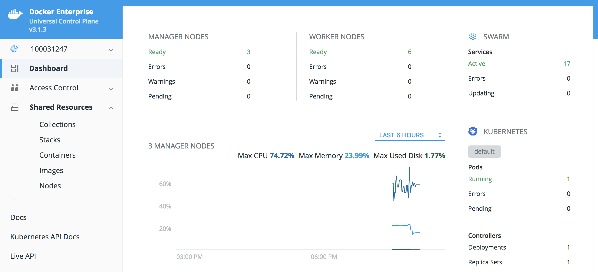
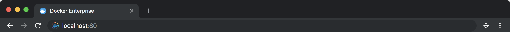
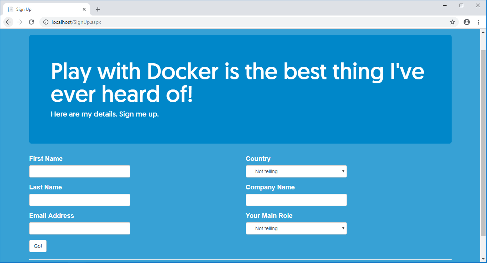
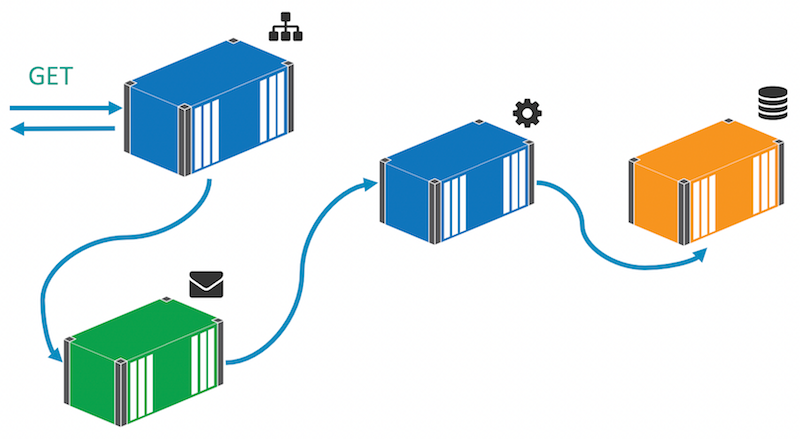
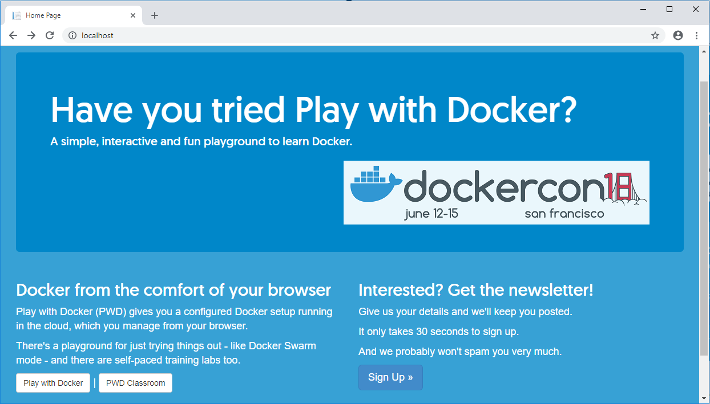
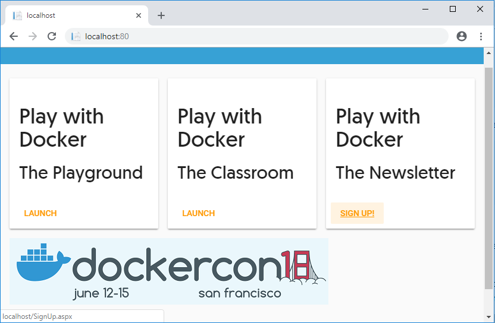

# Introduction 
This repo is copied from https://github.com/dockersamples/global-2018-hol/tree/master/mta-dotnet as of 12/2018.

It's purpose is to provide a solid application to experiement with .NET inside Jabil. 
These instructions are modified from Docker's original format to fit Jabil screens.

# Getting Started
To get started, please complete the Docker Training course provided by the Developer Services Team. 
While not required, it is strongly recommended.

In order to perform this lab, you will need to:
1.	Administrator rights on your machine
2.  Install Docker-Desktop for Windows
3.	Git for windows
4.	A non-IE web-browser (optional, but recommended)
5.	A choice Code Editor (Visual Studios Code is Recommended)
6.  A Powershell window (run as Administrator)

# Moving .NET/Windows Applications to Docker

You can run full .NET Framework apps in Docker on Windows containers. 
This hands-on lab shows you how to take an existing ASP.NET WebForms app, 
run it in Docker and then modernize the app by breaking features out and 
running them in separate containers.

The app you'll be using is modified from Docker's own video series 
[Modernizing .NET Apps for Developers](https://blog.docker.com/2018/02/video-series-modernizing-net-apps-developers/). 
This lab will get you experienced in using Docker to modernize traditional 
.NET applications, and then you can watch the video series for more in-depth walkthroughs.

> If you aren't familiar with the basic concepts of Docker, 
you can catch up by reviewing some of the self guided labs 
on the [Developer Services Site](https://jabil.sharepoint.com/sites/IT/DeveloperServices/Pages/Docker.aspx), 
or by reaching out to the Jabil Developer Team directly at 
[Docker@jabil.com](mailto:Docker@jabil.com).

## Table of Contents

* [Task 0: The Play with Docker Lab Environment](#0)
* [Task 1: Running the app in a container](#1)
* [Task 2: Deploy using Docker-Compose](#2)
* [Task 3: Fixing a performance issue](#3)
* [Task 4: Replacing the homepage](#4)
* [Task 5: Push Images to Docker Trusted Registry](#5)
* [Task 6: Deploy on Universal Control Plane](#6)

## <a name="0"></a>Step 0: The Docker EE Lab Environment

Login to the Docker Enterprise Edition session at the URL provided by your workshop organizer. 
This is a hybrid cluster, with Linux and Windows nodes. This workshop is designed for 
people attending an in-person workshop, but Steps 1-5 of this lab can be completed on your local 
machine, and then later pushed to Jabil's Docker Environmentvfor Step 6.

The left-hand navigation lists all the features available to this UCP. Click on 'Shared Resources' 
and then 'Nodes' to see all the environments in this Swarm. You should see a list of hostnames, 
with the corresponding role (of manager or worker), and with at least 1 worker that has Windows 
under OS/Arch. This is required for Step 6 to work. That will be the Windows worker node on the 
Swarm where this app will run when complete.



For this lab, we will need to use Powershell. Make sure Docker is running on your environment- 
it runs as a background Windows Service:

```powershell
Start-Service docker
```

If you have used this environment for other labs, first remove any existing containers:

```.term1
docker container rm --force $(docker container ls --quiet --all)
```

> Disregard any error stating that "docker container rm requires at least 1 argument" this time around. In this particular case, it means you have no containers on the system.

To start with you'll work with the Windows node directly, but at the end of the lab you'll deploy to the cluster to see how to run applications in production with Docker Enterprise.

## <a name="1"></a>Task 1: Running the app in a container

You're going to start with an ASP.NET 4.7.2 WebForms app which is meant to be built in Visual Studio and run in IIS. Rather than set up a unique environment, we will use Docker to build and run the app in a container.

You can package Windows server applications to run in Docker using existing deployment tools (like MSIs), or from source code. In this task you'll compile and package an ASP.NET app from source using Docker.

Start by cloning the Git repository for the sample app:

```.term1
cd ~/Documents

git clone https://github.com/BrazilPowered/docker-dotnet

cd docker-dotnet
```

## Task 1a: Build your Web-App Image

Your first task will be to build an image for our web app ui. Let's use the following requirements
1.  Place the Dockerfile in /docker/web
2.  Use a Multi-Stage Build
3.  Use the dotnet-framework version 4.7.2-sdk as the Base Image for your build-server image
4.  In each stage, define "powershell" as your default SHELL using the following args in exec form: "-Command", "$ErrorActionPreference = 'Stop';"

For your Build-Server stage:
1.  Use the "C:\src" folder as your container's Working Directory
2.  Copy the src\SignUp folder to the Working Directory on the Container Image
3.  Run the build.ps1 script (this will compile the app)

For your App Image stage:
1.  Use aspnet version 4.7.2-windowsservercore-ltsc2016 as the base image for your App server
2.  Use the "C:\web-app" as your container's Working Directory
3.  Remove the IIS Default Web Site with the following command: Remove-Website -Name 'Default Web Site';
4.  Add your website as the new IIS web-app on port 80 with the following command: New-Website -Name 'web-app' -Port 80 -PhysicalPath 'C:\web-app'
5.  Copy the compiled files from your build-server stage into the working directory of this container image. They are located at "C:\out\\_PublishedWebsites\SignUp.Web"

## Task 1b: Set up your Database

This version 1 uses containers for a SQL Server database and the ASP.NET app. You can set this up by building a Docker image from a Dockerfile that includes your passwords, your DB init or import scripts, and defining the volume that will store your data (remember, data in a container is not persistent sio we MUST use a Voloume for DB data).

Notice that we are using two separate images for the web app and DB services. It is important to keep as many part of your application that do different types of tasks as separate as possible. Since unrelated tasks will no longer be stuck to eachother this way, the app is kept cleaner and the maintenence made much easier.

First let's place the DB Dockerfile in docker/db, and fill it with this content:

```Dockerfile
# escape=`
FROM microsoft/mssql-server-windows-express:2016-sp1
SHELL ["powershell", "-Command", "$ErrorActionPreference = 'Stop'; $ProgressPreference = 'SilentlyContinue';"]

ENV ACCEPT_EULA="Y" `
    sa_password="DockerCon!!!" `
    DATA_PATH="C:\mssql"

VOLUME ${DATA_PATH}

WORKDIR C:\init
COPY . .

CMD ./init.ps1 -sa_password $env:sa_password -Verbose

HEALTHCHECK CMD powershell -command `
    try { `
     $result = Invoke-SqlCmd -Query 'SELECT TOP 1 1 FROM Countries' -Database SignUpDb; `
     if ($result[0] -eq 1) { return 0} `
     else {return 1}; `
} catch { return 1 }
```

> Notice the "# escape=`" at the top. For windows files, this eliminates the need for using double backslashes (\\) for every single pathname. But this *alone* MUST be the very first line of the Dockerfile in order to work

This Dockerfile pulls 8 layers:
1.  The base image uses mssql-server-windows-express version 2016-sp1
2.  It sets the execution environment to be powershell, enabling special functionality like a "SilentlyContinue" to the SQL-Server setup
3.  It creates 3 environment variables: 1 meets the requirement of accepting an EULA, 2 sets the DB password, and 3 sets the path all the SQL server data will be stored, which is important for when:
4.  It defines a volume to be at a path pulled from that same path in the ENV set above, keeping all the DB data persistent
5.  It sets a working directory for copying and executing all the files and scripts for this image
6.  It copies the files in the docker/db folder to the working directory in the container (".")
7.  It executes the init.ps1 script with an array of required arguments
8.  And finally sets a "Healthcheck" to provide a way for ther Docker engine to know if the DB service fails. This one returns healthy *if* one or more results are returned by the DB query. the Countries table MUST return values for this web-app to work, so we know it is unhealthy if $result isn't 1.

Healthchecks are vital to your application's lifecycle in a production container environment. While Docker can detect when your container fails, it doesn't know how your app works; so if your web application has an error that kills your user access, but leaves the server up and running, Docker will keep the container running in a 'healthy' state. To prevent this problem, Healthchecks can be used to alert Docker when normal functionality is broken, giving you the chance to enable automatic actions, or receive messages yourself. Never deploy to PROD without a solid healthcheck that you understand.

> Let's take a minute to notice that the Windows machine you are using in this lab doesn't need to have SQL Server, Visual Studio or even MSBuild installed - every step in the build process happens inside containers, using images which are packaged with the build toolchain.

#### Examine your web-app Dockerfile
While the images are building, have a look at the Dockerfile for the Web application in "docker/web". You'll see there are two stages. The first stage compiles the application using MSBuild:

```Dockerfile
FROM microsoft/dotnet-framework:4.7.2-sdk AS builder
SHELL ["powershell", "-Command", "$ErrorActionPreference = 'Stop';"]

WORKDIR C:\src
COPY src\SignUp .
RUN .\build.ps1
```

This `builder` stage uses the `microsoft/dotnet-framework:4.7.2-sdk` image, which has the entire .NET 4.7.2 Software Development Kit toolchain needed to compile an ASP.NET 4.7.2 application (including MSBuild, NuGet, and the Web Deploy packages). It is made specifically for cases like our Multi-Stage build.

>Remember, we don't always need everything used to compile an application when we run an application. A multi-stage build allows us to separate the build process from the running application. Using this method allows our PROD container can be much smaller & more efficent, having only the minimum resources needed to run your app with maximum performance.

The `builder` stage Dockerfile copies the source code into the image and just runs the existing <a href="https://github.com/BrazilPowered/docker-dotnet/blob/1-imagebuilding/src/SignUp/build.ps1" target="_blank">build.ps1</a>) script. When this stage completes, the output is a published website folder, which will be available for later stages to use. 

The second stage uses the `aspnet:4.7.2-windowsservercore-ltsc2016` image as the base, which is a Windows Server Core image with IIS and ASP.NET 4.7.2 already configured:

```Dockerfile
FROM microsoft/aspnet:4.7.2-windowsservercore-ltsc2016
SHELL ["powershell", "-Command", "$ErrorActionPreference = 'Stop';"]

WORKDIR C:\web-app
RUN Remove-Website -Name 'Default Web Site'; `
    New-Website -Name 'web-app' -Port 80 -PhysicalPath 'C:\web-app'

COPY --from=builder C:\out\_PublishedWebsites\SignUp.Web .
```

The `RUN` command sets up the website using PowerShell. The `COPY` instruction copies the published website from the builder stage into your new container.

Again, you don't need Visual Studio or IIS installed on your own machine to run the web app in a container, nor do you need SQL Server installed to run the application database. It will all be done using only Docker.

When the build has finished, we will want to deploy the application using Docker Compose.

Make sure you are in the root `~/Documents/docker-dotnet` directory you pulled from github and then go ahead and build both those images.:

```s
cd ~/Documents/docker-dotnet

docker image build -t signup-db:v1 docker/db

docker image build -t signup-app:v1 -f docker/web/Dockerfile .
```

> Note: The second build command above uses the `-f` (`--file`) option, pointing to the Dockerfile at the location shown thereafter. This is because the Dockerfile being used needs the local context (the `.` at the end) in order to send files from both the directory after `-f` as well as the `src` folder in the top directory.

##  <a name="2"></a>Task 2: Deploy using Docker-Compose

If we want to stand up a single container, it is easy to execute a `docker run` command with the options we learned will set it up in our environment. But to work in tandem with another app, we would need to *manually* declare the appropriate networks, volumes, etc for EACH container EVERY time... Let's save ourselves that hassle with docker-compose.

We need to write a docker-compose file (remember: it's a YAML file) with the following requirements:

1.  Use compose version 3.3
2.  Include 2 services, named signup-db and signup-app.
3.  The signup-db service should have 1 network, app-net, and use the image we can build with the SQL-Server DB Dockerfile
4.  The signup-app service also needs the app-net network, but will expose port 80 to the outside network (on port 80). The image here should be the one we can build from the docker/web Dockerfile.
5.  The signup-app service should also use the "depends_on" parameter to make sure the signup-db is started first, to make sure the connection strings will find the db.
6.  The app-net network should be declared, and it should be configured to use the existing external network which is already named "nat"

### How should the Docker-Compose file look?
Here's what the docker-compose fole should look like when complete:

> Please attempt this exercise on your own using the requiremnts above before reviewing the file below

```yml
version: '3.3'

services:
  signup-db:
    image: signup-db:v1
    networks:
      - app-net

  signup-app:
    image: signup-app:v1
    ports:
      - "80:80"
    depends_on:
      - signup-db
    networks:
      - app-net

networks:
  app-net:
    external:
      name: nat
```

Let's deploy the application using Docker Compose:

```s
docker-compose up -d
```

Docker Compose will start containers for the database and the web app. The compose file configures the services using the database image and the application image you've just built.

When the `docker-compose` command completes, your application is running in Docker, in Windows containers, on the Windows node. You can see all the running containers:

```s
docker container ls
```

The HTTP port for the web container is published so the app is available to the outside world.

> To see the app running, navigate to your IP address in a local web browser. Since the container was mapped to port `80`, we won't have to specify a port number.)



The application is a newsletter sign-up app for Play with Docker. It will take a little while to load because the app uses Entity Framework and on startup it deploys the database schema. The home page has some basic information and link buttons. Click the _Sign Up_ button and you'll see a registration form:



> Don't worry, the data you use for this lab only goes to your local DB container, and is never shared anywhere else. It will all be gone once you end the lab and clean up your environment.

Go ahead and fill in the form. When you click _Go_, the data is saved to SQL Server running in a container. The SQL Server container doesn't publish any ports, so it's only accessible to other containers and the Docker API. 

Check that your data is stored by running a PowerShell command in the Windows terminal. Don't forget to replace `app_signup-db_1` with the name of your db container:

```s
docker container exec app_signup-db_1 powershell -Command "Invoke-SqlCmd -Query 'SELECT * FROM Prospects' -Database SignUpDb"
```

This executes a SQL query inside the SQL Server container, using the `Invoke-SqlCmd` cmdlet which is installed in the image.

The output is the result of the query - you'll see a row for each time you submitted the form, something like this:

```
ProspectId          : 1
FirstName           : Elton
LastName            : Stoneman
CompanyName         : Docker, Inc.
EmailAddress        : elton@docker.com
Role_RoleCode       : DA
Country_CountryCode : GBR
```

> The app is running fine in Docker, with no code changes from the original ASP.NET 4.7.2 codebase. The Dockerfile has all the logic to build and package the app, so any developer (and all the CI servers) can build and run the app from source - the only dependency is Docker.

Next you'll go on to modernize the app, fixing some issues with the current architecture.

## <a name="3"></a>Task 3: Fixing a performance issue

Right now the app makes a synchronous call to SQL Server when a new prospect signs up. While the app is looking up reference data and saving the new row, it has exclusive use of one of the connections in the database connection pool. You can scale up the web app by running many containers, but under high load the app will starve the connection pool and SQL Server becomes a bottleneck.

The next version of the app uses a new architecture:



Now when users save data, the web app publishes an event to a message queue. A message handler listens for those events and makes the SQL Server calls. This architecture does scale, because the message queue smooths out any peaks in traffic.

Switch to the `2-performbetter` branch which has the new version of the app, and build it using Docker Compose:

```s
git checkout -f 2-performbetter

docker-compose `
  -f .\app\docker-compose.yml `
  -f .\app\docker-compose-local.yml `
  -f .\app\docker-compose-build.yml `
  build
```

> Notice here that *Compose* merges the three input files given to spin up your app. The first specifies the structure of the app and the second adds the build details, while the third gives the instructions to build any of the missing components. They're kept separate because they have different concerns, and this keeps them clean. Parts of these can later be combined when making a *stack file*.

While it builds, have a look at the <a href="https://github.com/BrazilPowered/docker-dotnet/blob/2-performbetter/docker/web/Dockerfile" target="_blank">new Dockerfile for the web app</a>. The app has been upgraded to use a NuGet repository configured from a file in the packages.config, and then copies the rest of the source code & executes msbuild in a later step. In this way, the builder stage runs the build steps directly in Docker rather than using a manually tracked PowerShell build script:

```Dockerfile
FROM dockersamples/mta-dev-web-builder:4.7.1 AS builder
SHELL ["powershell", "-Command", "$ErrorActionPreference = 'Stop';"]

WORKDIR C:\src\SignUp.Web
COPY .\src\SignUp\SignUp.Web\packages.config .
RUN nuget restore packages.config -PackagesDirectory ..\packages

COPY src\SignUp C:\src
RUN msbuild SignUp.Web.csproj /p:OutputPath=c:\out /p:DeployOnBuild=true
```

> Running the `nuget restore` and `msbuild` steps separately takes advantage of Docker's image layer cache. If the package file hasn't changed, the `nuget restore` layer gets loaded from the cache, saving an expensive time-wasting operation in the build.

The new version of the code publishes an event from the web app to a message queue when a user signs up. There are some new lines in the application image stage, specifying values for environment variables:

```Dockerfile
ENV APP_ROOT="C:\web-app" `
    MESSAGE_QUEUE_URL="nats://message-queue:4222" `
    DB_CONNECTION_STRING_PATH=""
```

- `APP_ROOT` is the path where the application content gets stored in the image, stored in a variable because it gets used in multiple places

- `MESSAGE_QUEUE_URL` is the URL of the message queue. The web app uses an environment variable for this configuration, the default value expects to find the message queue in a container called `message-queue`. (Take note of whatever name-value you would use here. This container name will be important later.)

- `DB_CONNECTION_STRING_PATH` is the path to the .NET config file that contains the database connection string. The blank value means the app loads the default config file, but this enables the app to use *Docker secrets* for the connection string.

Docker Compose also builds a console application, which is the message handler listening for events. The <a href="https://github.com/BrazilPowered/docker-dotnet/blob/2-performbetter/docker/save-handler/Dockerfile" target="_blank">Dockerfile for the message handler</a> is very similar to the web app --> stage 1 compiles the console app, and stage 2 packages it to run in a Windows Server Core container.

When the build completes, run the new version of the app using Docker Compose:

```s
docker-compose `
  -f .\docker-compose.yml `
  -f .\docker-compose-local.yml `
  up -d
```

You'll see output saying that the database container is up-to-date, and then the message queue and message handler container get created, and the web container gets recreated. Compose uses the new specification as the desired state, compares it to the running containers, and creates any containers it needs.

The new website will be available on your same Windows Docker host. Browse to the Windows server as before - using the hostname from _Session Information_. You'll see the new homepage has been improved with an advert for DockerCon, and the developers added some more complex naviation.



Click on the _Sign Up_ button and you'll see the UI and UX for the app is the same. Fill the form in again, and the website responds in the same way - but now the save is happening asynchronously through the message handler.

Check that your new data is there in the SQL Server container:

```sql
docker container exec app_signup-db_1 powershell -Command "Invoke-SqlCmd -Query 'SELECT * FROM Prospects' -Database SignUpDb"
```

> You'll see both sets of details you saved because this version of the app uses the same database container as the last version.

And look at the logs for the message handler - you'll see entries showing that it has received a message and saved the data:

```s
docker container logs app_signup-save-handler_1
```

It's easy to add functionality to your app when it's running in Docker. This version of the app is using <a href="http://nats.io" target="_blank">NATS</a>, an open-source production-grade message queue. The NATS team publish an official Docker image which means you can add messaging to your app just by running a container.

> This version of the app does scale. You could run dozens of web containers and just a handful of message handler containers. Under high load, the message queue will retain messages until the handlers have capacity to process them - and SQL Server is no longer a bottleneck.

In the next task you'll extract the homepage functionality from the app and run it in a separate container.

## <a name="4"></a>Task 4: Replacing the homepage

Product owners often want to change UI features quickly - so they can release them and get fast feedback. Traditional apps make that difficult because the monolithic codebase means you need to do a lot of regression testing, even for simple changes.

Extracting a frequently-changing feature from the monolith and running it in a separate container enables fast, safe updates. You can change the UI by replacing the container, without having to test the rest of the monolith.

Switch to the `3-replacingparts` branch to pull the code pieces we'll need for this:

```s
git checkout -f 3-replacingparts
```

In this part, other developers have already made the code changes to pull the homepage into it's own service. Your task is to make a dockerfile for this new <a href="https://github.com/BrazilPowered/docker-dotnet/blob/3-replacingparts/docker/homepage/index.html" target="_blank">custom hopepage</a> component, and then to modify your compose file to add this new component. 

The Dockerfile for the homepage can be very simple, with only the following requirements:

1.  Make your Dockerfile in the docker\homepage folder where the index.html file already exists.
2.  Use an iis image for your Base Layer, the nanoserver-sac2016 version
3.  Copy the contents of this folder (the homepage and its images) to the IIS published directory on the container (C:\inetpub\wwwroot). Make sure to include the full path from the project root directory (./docker/homepage) so that you can build this image from there.

Codewise, only two things are required to pull this off. The first is simple: package a static HTML file on top of a server image, in this case the `microsoft/iis` image running in Nano Server. The second is to perform the code change in the ASP.NET app, modifying the <a href="https://github.com/BrazilPowered/docker-dotnet/blob/3-replacingparts/src/SignUp/SignUp.Web/Default.aspx.cs" target="_blank">Default.aspx.cs codebehind</a> to load the homepage content from the new component. You can use what the developers did here as an example in your own ASP.NET apps:

```cs
namespace SignUp.Web
{
    public partial class _Default : Page
    {
        protected void Page_Load(object sender, EventArgs e)
        {
            var homepageUrl = ConfigurationManager.AppSettings["Homepage.Url"];
            if (!string.IsNullOrEmpty(homepageUrl))
            {
                Log.Info($"Loading homepage content from: {homepageUrl}");
                Response.Clear();
                var request = HttpWebRequest.Create(homepageUrl);
                var response = request.GetResponse();
                using (var stream = response.GetResponseStream())
                using (var reader = new StreamReader(stream))
                {
                    var html = reader.ReadToEnd();
                    Response.Write(html);
                }
                Response.End();
            }
        }
    }
}
```

Since we have made changes to the code which make up our existing app image, Let's rebuild it, along with the new image for our homepage service. Since we only made changes to the app and new homepage component, we will only need to build those two.

```s
docker image build -t signup-app:v4 -f docker/web/Dockerfile .

docker image build -t signup-homepage:v1 -f docker/homepage/Dockerfile .
```

Now, we modify our docker-compose file to use this new component

Take a look at the the compose files we had after the end of the last lab. The
<a href="https://github.com/BrazilPowered/docker-dotnet/blob/3-replacingparts/app/docker-compose-local.yml" target="_blank">first, docker-compose-local.yml</a>, sets up the details for the services, including things like port numbers accessible to the outside world... but we don't need any of those for this image. Our Web-App already has external network access, and it has the codebehind controller to route traffic to this container. We only need to add this new service to <a href="https://github.com/BrazilPowered/docker-dotnet/blob/3-replacingparts/app/docker-compose.yml" target="_blank">the second, docker-compose.yml</a>, to name the service and tell it to access the app-net network so that codebehind controller can communicate with it.

Adding this at the bottom of the second docker-compose.yml file should accomplish what we need:

```YAML
  signup-homepage:
    image: dockersamples/mta-dev-signup-homepage:v1
    networks:
      - app-net
```

Now if we start the app with docker-compose, we should see the new homepage service working as expected:

```s
docker-compose up -d
```
> Note that we have condensed the compose files to a single yml file. This makes it easier to prepare the yml for deployment in a production environment. (We can continue to use the docker-compose build process using the multiple yml files in our app folder when we continue development at a later time.)

You'll see that a new homepage container gets started, and the web app container gets replaced with a new container. 

The new version is available on your same Windows Docker host. Navigate to the webpage on your Windows server through your web browser just as before.

Now when the ASP.NET web container receives a request, it calls out to the homepage container across the docker app-net netwoprk which renders the new homepage. That new homepage is a modern UI written in Vue.js:



If the product team doesn't like the new UI, they can easily replace it by building a new homepage and replacing the homepage container. The web app container doesn't need to change, so there are no regression tests to run.

> The app has a modern architecture now, powered by Docker and without needing a full rewrite. You've extracted key features from the app and run them in separate containers, using Docker to plug everything together, and to give you a consistent build and deployment process for the whole solution.

So far you've been running the application using Docker on the Windows node. Next you'll learn how to push the images to a private registry and run the app in a cluster with Docker swarm mode.